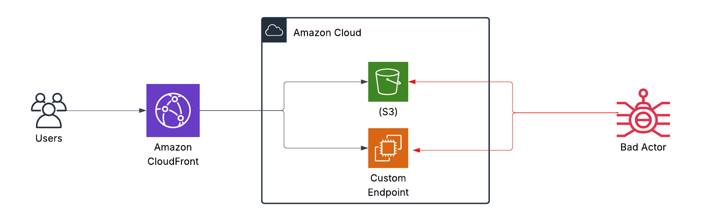

# Secure Your Origins - AWS CloudFront Security Implementation

## Project Overview
This project demonstrates comprehensive security implementations for various origin types (S3, Custom Origins, ALB) behind Amazon CloudFront. It focuses on implementing best practices for securing origin access while maintaining high availability and performance.

## Architecture Diagram


## Architecture Components

### CloudFront Configuration
- **CloudFront Distribution**: Main content delivery service
- **Origin Access Control (OAC)**: For S3 bucket access
- **Custom Headers**: For origin authentication
- **SSL/TLS Configuration**: For secure communication

### Origin Types
- **S3 Buckets**: Static content storage
- **Application Load Balancers**: Dynamic content
- **Custom Origins**: External endpoints
- **API Gateway**: REST APIs

### Security Components
- **WAF Rules**: Web application firewall protection
- **Security Groups**: Network access control
- **IAM Roles**: Access management
- **SSL Certificates**: Data encryption

## Security Features
- Origin Access Control (OAC) for S3
- Custom header authentication
- IP-based restrictions
- SSL/TLS encryption
- WAF protection rules

## High Availability Features
- Multi-region origin support
- Origin failover configuration
- Origin shield implementation
- Cache optimization
- Error handling and custom error pages

## Monitoring and Logging
- CloudWatch metrics
- Access logs analysis
- Origin health monitoring
- Security event logging
- Real-time alerts

## Implementation Steps

### 1. CloudFront Setup
```yaml
CloudFrontDistribution:
  Type: 'AWS::CloudFront::Distribution'
  Properties:
    DistributionConfig:
      Origins:
        - DomainName: !Sub '${OriginBucket}.s3.amazonaws.com'
          Id: S3Origin
          OriginAccessControlId: !Ref CloudFrontOAC
```

### 2. S3 Origin Security
```yaml
OriginBucket:
  Type: 'AWS::S3::Bucket'
  Properties:
    PublicAccessBlockConfiguration:
      BlockPublicAcls: true
      BlockPublicPolicy: true
      IgnorePublicAcls: true
      RestrictPublicBuckets: true
```

### 3. Custom Origin Security
```yaml
SecurityGroup:
  Type: 'AWS::EC2::SecurityGroup'
  Properties:
    SecurityGroupIngress:
      - IpProtocol: tcp
        FromPort: 443
        ToPort: 443
        CidrIp: !Ref CloudFrontIPRange
```

### 4. WAF Configuration
```yaml
WebACL:
  Type: 'AWS::WAFv2::WebACL'
  Properties:
    DefaultAction:
      Allow: {}
    Rules:
      - Name: BlockUnwantedRequests
        Priority: 1
        Statement:
          RateBasedStatement:
            Limit: 2000
            AggregateKeyType: IP
```

## Best Practices Implemented
- Origin access restriction
- Least privilege principle
- Encryption in transit
- Regular security audits
- Automated deployment

## Tools and Services Used
- AWS CloudFormation
- AWS CLI
- AWS SDK
- Terraform (optional)
- Monitoring tools

## Future Enhancements
- [ ] Lambda@Edge integration
- [ ] Advanced WAF rules
- [ ] Custom origin authentication
- [ ] Automated security testing
- [ ] Enhanced monitoring

## Security Patterns

### S3 Origin Pattern
```yaml
# S3 bucket with OAC
Resources:
  CloudFrontOAC:
    Type: 'AWS::CloudFront::OriginAccessControl'
    Properties:
      OriginAccessControlConfig:
        Name: !Sub ${AWS::StackName}-OAC
        OriginAccessControlOriginType: s3
        SigningBehavior: always
        SigningProtocol: sigv4
```

### Custom Origin Pattern
```yaml
# Custom origin with header authentication
Origins:
  - DomainName: api.example.com
    Id: CustomOrigin
    CustomOriginConfig:
      OriginProtocolPolicy: https-only
    OriginCustomHeaders:
      - HeaderName: X-Origin-Auth
        HeaderValue: !Ref SecretHeader
```

## Resources and References
- [CloudFront Documentation](https://docs.aws.amazon.com/AmazonCloudFront/latest/DeveloperGuide/Introduction.html)
- [AWS Security Best Practices](https://aws.amazon.com/security/security-learning/)
- [Origin Access Control](https://docs.aws.amazon.com/AmazonCloudFront/latest/DeveloperGuide/private-content-restricting-access-to-s3.html)

## Author
- **Name**: [Your Name]
- **LinkedIn**: [Your LinkedIn]
- **GitHub**: [Your GitHub]

## License
This project is licensed under the MIT License - see the [LICENSE](LICENSE) file for details.
